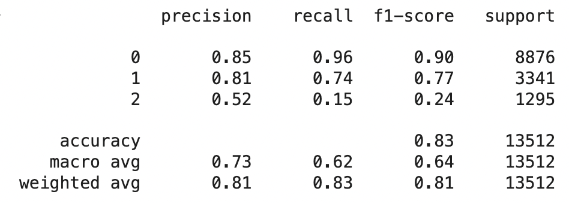
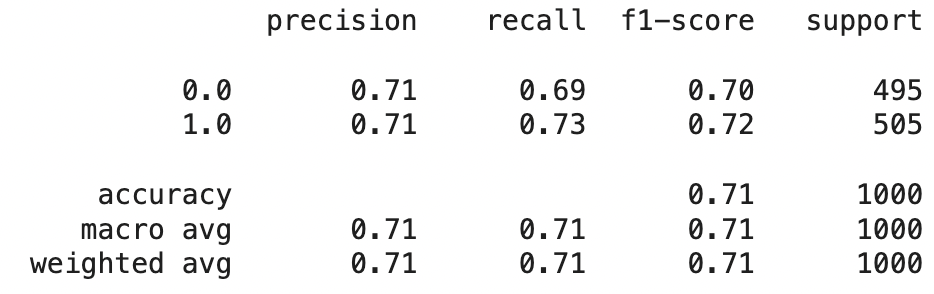

# Connect 4 Project - ML Bot Powered Game

A browser-based recreation of the classic Connect 4 Game --- Deployed on Github Pages and built using HTML/CSS/JS for the frontend with Python + Flask for the backend and Render deployement. Utilizes a ML bot to create a tough challenge for this single player game

🎮 Try it now: [Live demo](https://henryw0225.github.io/Connect-4-Project) 

NOTE: First bot move might be delayed by ~1 minute due to Render cold start :(

## Datasets (Two Approaches)
1) UCI ML Repository - Connect-4 (All valid 8-ply positions): [Link](https://archive.ics.uci.edu/dataset/26/connect+4)

Format: 42 cells in column-major, bottom→top, cells ∈ {b (blank), x, o}, label = game-theoretic outcome for first player under optimal play

Prep: Change column titles, mapping b/x/o -> 0/-1/1 respectively, mapping win/loss/draw -> 0/1/2 respectively 

2) Self-Generated Dataset using an Optimized Negamax Algorithm (~5000 labeled examples)

Generation: Used a negamax algorithm with a depth of 10 optimized with alpha-beta pruning, bitboards and a transposition table to predict match outcome on 5000 randomly generated valid board states

Format: 42 cells in column-major, bottom->top, cells ∈ {0 (blank), -1, 1}, label = predicted outcome for the next player to move

Prep: Change column titles, mapping win/loss/draw -> 0/1/2 respectively 

## ML Model - Random Forest Classification Model

[Google Colab Notebook](https://colab.research.google.com/drive/1as3zdlM8M4ib0DaZYNVKM8N6XbAr73SA?usp=sharing)

Split dataset into training data (80%) and testing data (20%)

Used a Random Forest Classification Model from scikit-learn with 100 trees with max features being square root

## Results

Model 1 - UCI Dataset

Model 2 - Self-Generated Dataset

## Improvements (10/26/2025)

Model: A random forest classification model only remembers patterns but won't understand the rules of the game such as the objective is 4 in a row. Could try and use reinforcement learning for a better bot such as using an Alpha-Zero style (policy/value net + MCTS, self-play)

## Contact
Email: hw363929@gmail.com

GitHub: HenryW0225

